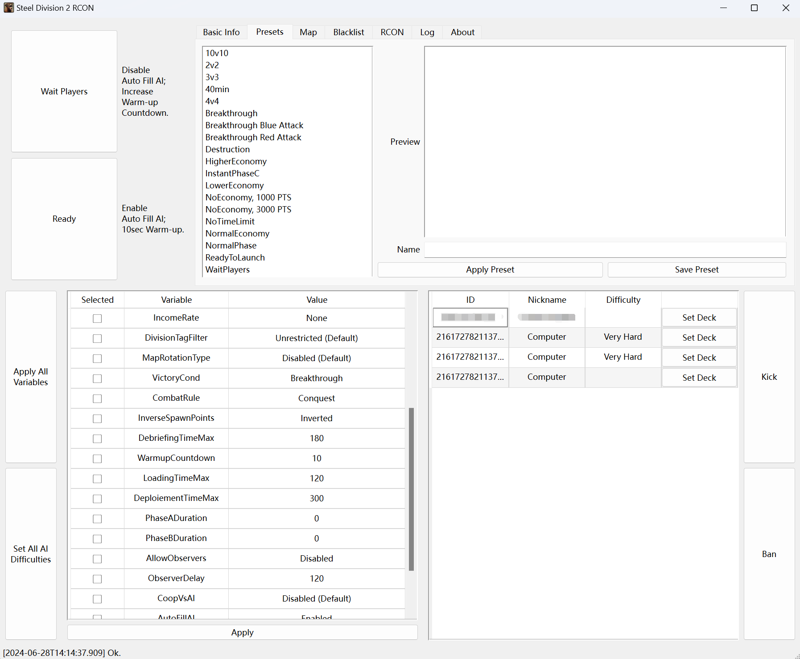

# Steel Division 2 RCON Tool

A RCON tool for managing SD2 servers with ease and intuitive interface.

## Features

-   Fast Session Setup using Custom Presets;
-   Support most variables and all map previews;
-   Coop functions such as setting AI difficulty and deck code.

## Introduction

I've recently been searching for such tools but none really fits my need. The primary goal of this tool is the two big buttons on the top left: don't start the game while my friends are preparing decks and start after they are ready. Typing stuff can get the job done but it's not just a task too tedious, but also takes swift hands to send the command before the warm up is finished. So I wrote my own tool for this very purpose.

Blacklist and kick logic is not yet written since I never used them. I'll update them in spare time.

The code is, mostly, open to customization in preparation for the release of WARNO's dedicated server. It's quite easy to add support for WRD and SD44 as well. The only pain is screenshoting every map under all game modes for the map preview.

*I can't wait to spam BM-30s in 10v10 Death Row against Hardest AI in WARNO.*

This is my first attempt of using Qt. Many logics are implemented before I learned Qt has better solutions, so expect bad code designs :P

## Quick Manual or, Quirks and Mumblings

1.   Before hitting "Apply", you need to select which variables to apply. Same goes to saving presets.

2.   Variable value dropdown menu has this quirky problem: when select a value from the dropdown, the value is not immediately applied. You need to click another cell to make it lost focus, then the value is actually applied.

     *I attempted fixing this issue in AI difficulty dropdown, but at a cost of not-so-good-looking style. I'll probably explore other solutions in the future.*

3.   Changing game mode (i.e. `VictoryCond` or `CombatRule`) will update the map list and preview; applying them will also apply the map to the correct variant automatically.

4.   You can use a domain name as the RCON server address. It *should* support both IPv4 and IPv6 connections.

     *(I can't find a RCON library that supports name resolution so I wrote my own.)*

5.   Setting the player deck does not verify the correctness of the deck code! Deck code format is non-disclosed from Eugen, so I cannot check whether the input is correct or not.

## Build From Source

My environments are:

-   Windows 11
-   CMake 3.29.2
-   MinGW 13.2 (win32-seh-ucrt) by [niXman](https://github.com/niXman/mingw-builds-binaries/releases/tag/13.2.0-rt_v11-rev1)
-   Qt 6.5.2

You can open the `CMakeLists.txt` with QtCreator and build.

I didn't include the icon file in the repository. The icon in the release build is extracted from SD2 executable file.

## Future Plans

-   Implement Kick and Blacklist logic.
-   Add WARNO support (when it come out).
-   (Probably?) Add WRD and SD44 support.